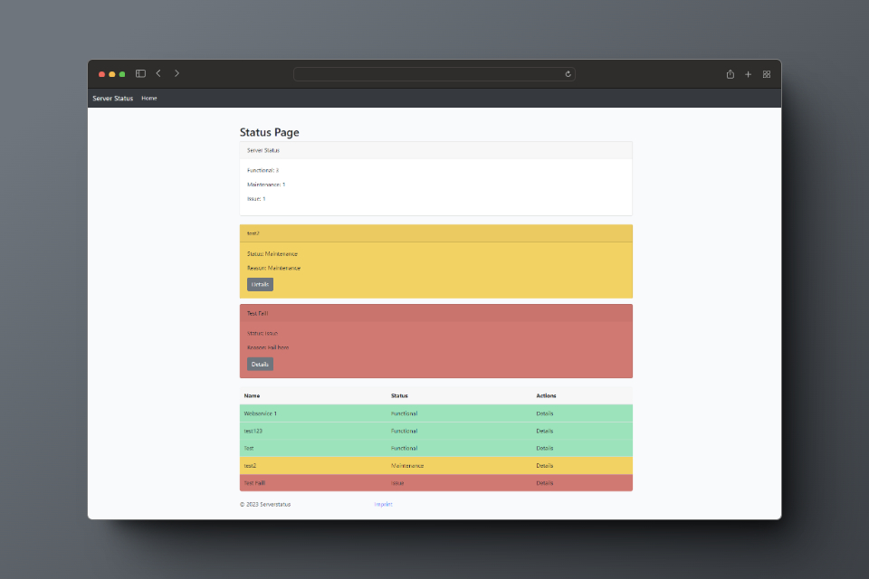
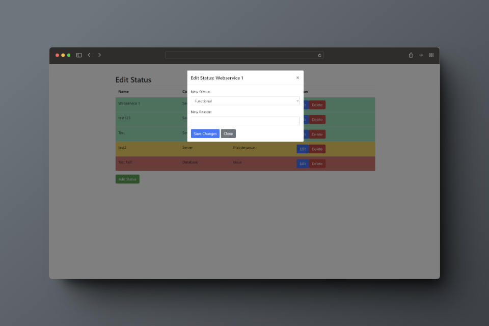

# PHP STATUS

## Overview

This Status Page script provides a simple and customizable way to manage and display the status of various services or components in your system. It allows you to track the status of different objects, view their details, and update their status with ease. Release of an old project :-) No Database required

## Features

-   **Dashboard Overview:** Get an overview of the functional, maintenance, and issue statuses of your services.
    
-   **Detailed Status Cards:** View detailed cards for services under maintenance or experiencing issues. Each card displays the service name, current status, reason, and provides a button to view further details.
    
-   **Tabular View:** Check the status of all services in a tabular format. The table highlights each service's status with colors based on the configuration.
    
-   **Interactive Modals:** Easily update, edit, or delete the status of each service through interactive modals. Modal windows provide a user-friendly interface to manage your services.
    
-   **Configuration Options:** Customize the status types, categories, and maximum history entries through the `config.json` file.
    

## Usage

1.  **Configuration:**
    
    -   Open the `config.json` file to define the categories, status types, and maximum history entries according to your needs. 
    -   Edit the following Files if you changed the categories: index.php line 48 to 59 and line 80, change.php line 115
    -   Set your pin for the "dashboard" in the pin.php
2.  **Adding and Managing Status:**
    
    -   Access the `change.php` file to manage the status of your services.
    -   Add, edit, or delete status entries using the provided buttons.
3.  **Viewing Status:**
    
    -   Open the `index.php` file to view the overall status of your services.
    -   Utilize the detailed cards for services under maintenance or experiencing issues.
    -   Check the tabular view for a comprehensive overview of all services.
4.  **Interactive Modals:**
    
    -   Click on the "Details" button in the tabular view or the card view to open modals for more information.
    -   Edit or delete status entries directly from the modals.

## How to Run

-   Upload the entire script to your web server.
-   Make sure the script has write permissions for the `status.json` file.
-   Access the `change.php` file to manage status entries.
-   View the overall status on the `index.php` page.

## License

This project is licensed under the MIT License with an attribution condition. See the LICENSE file for details.

## ToDo:
Load the categories dynamically everywhere.  